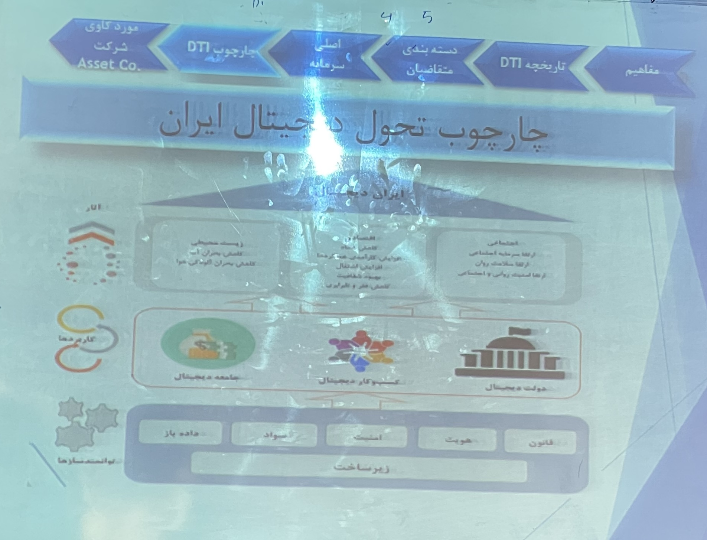
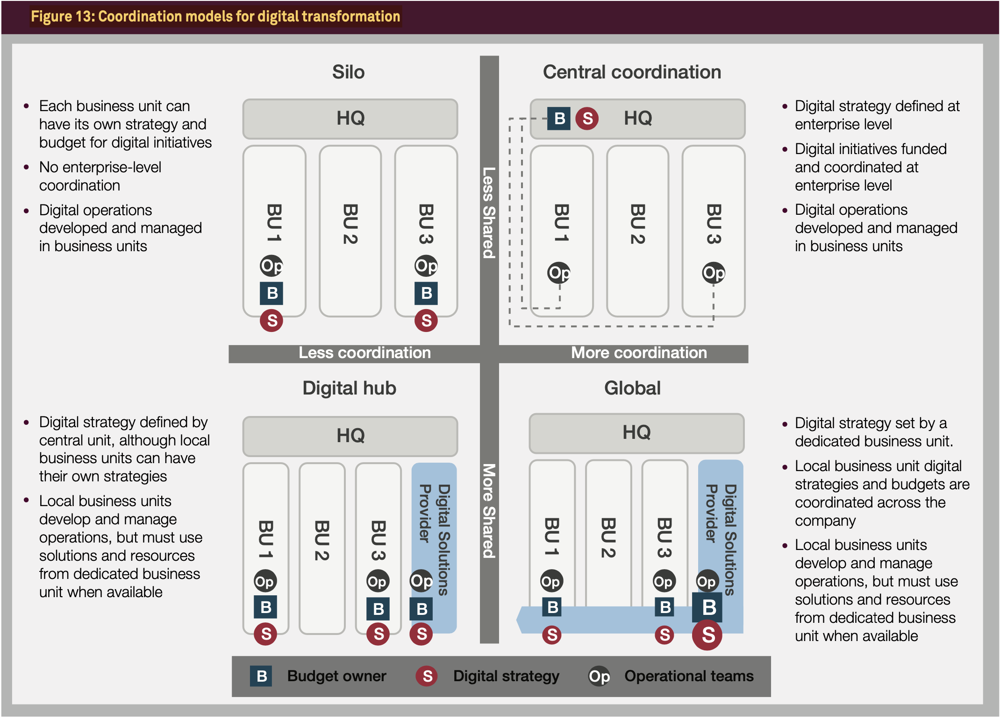
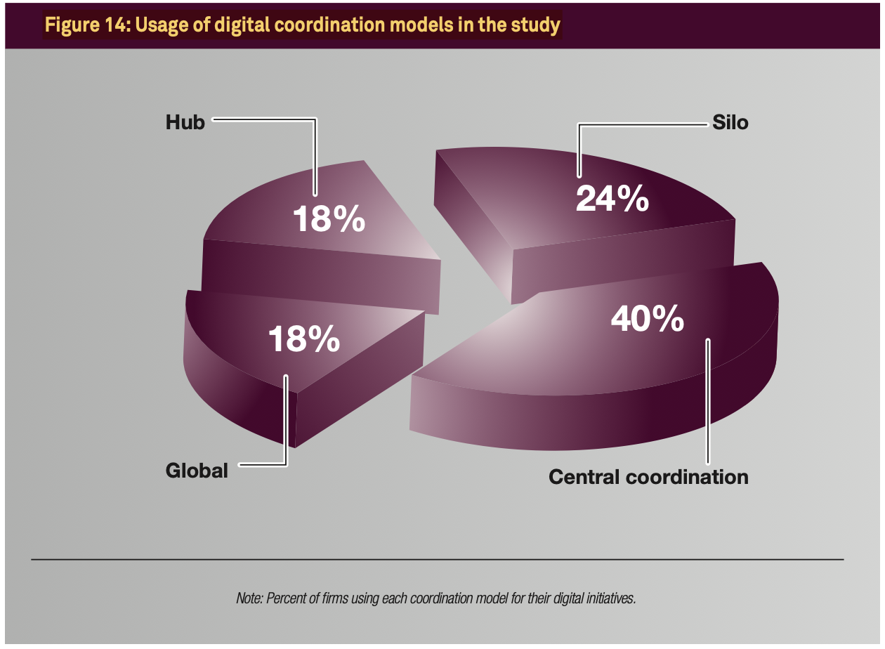
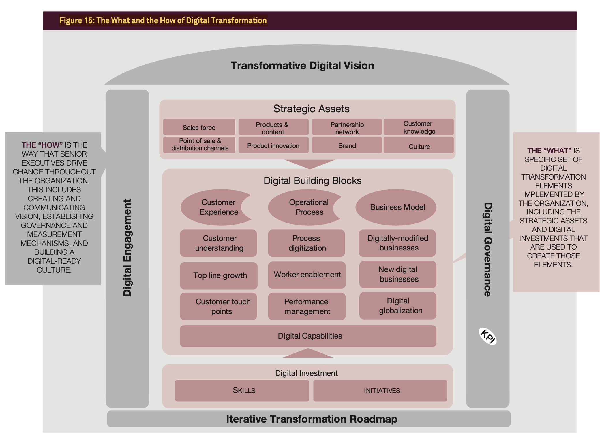
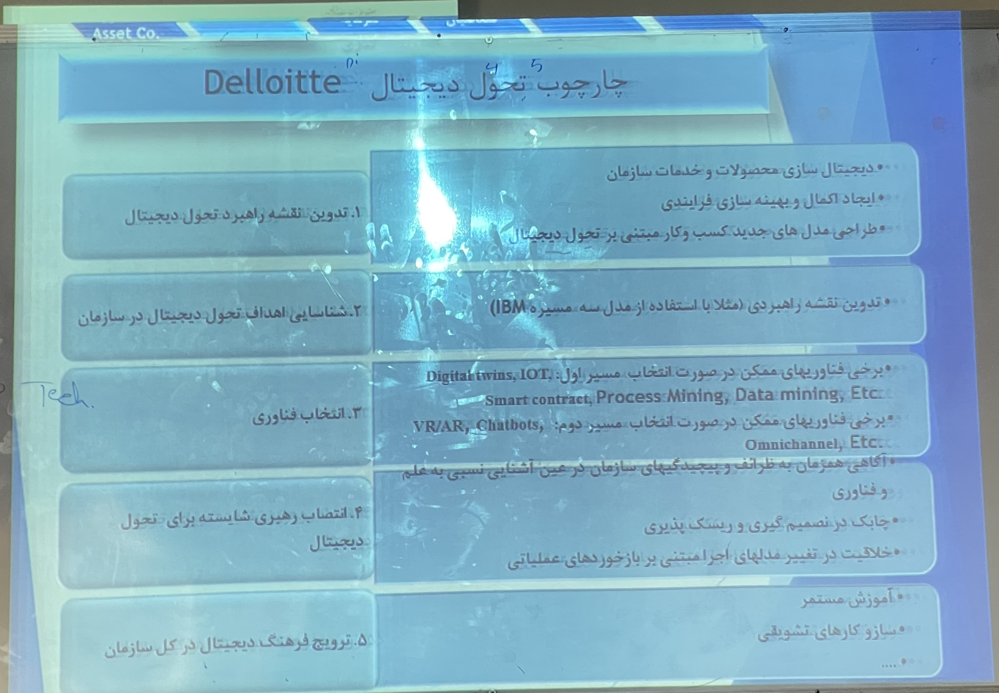
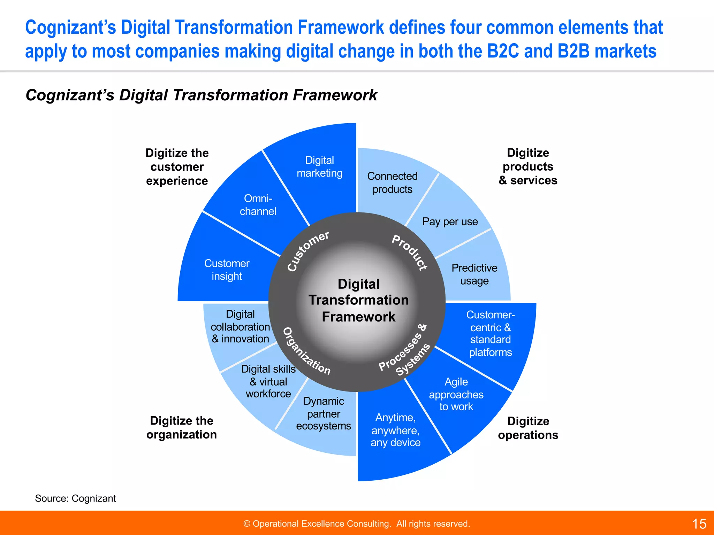
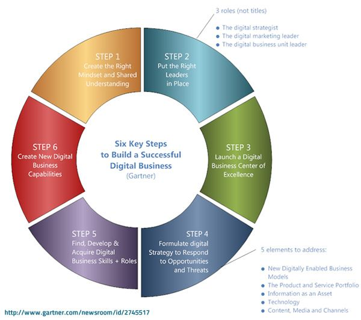
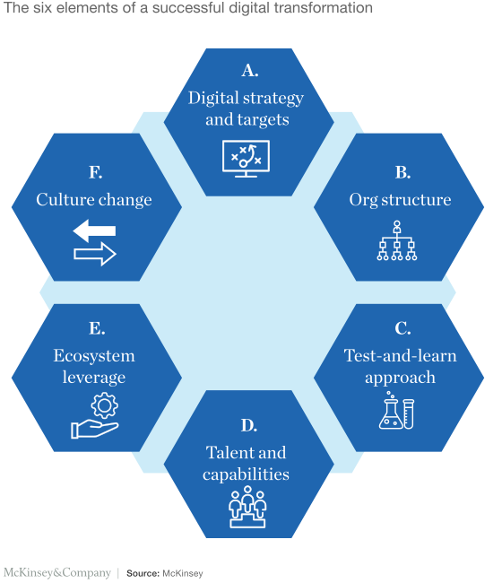
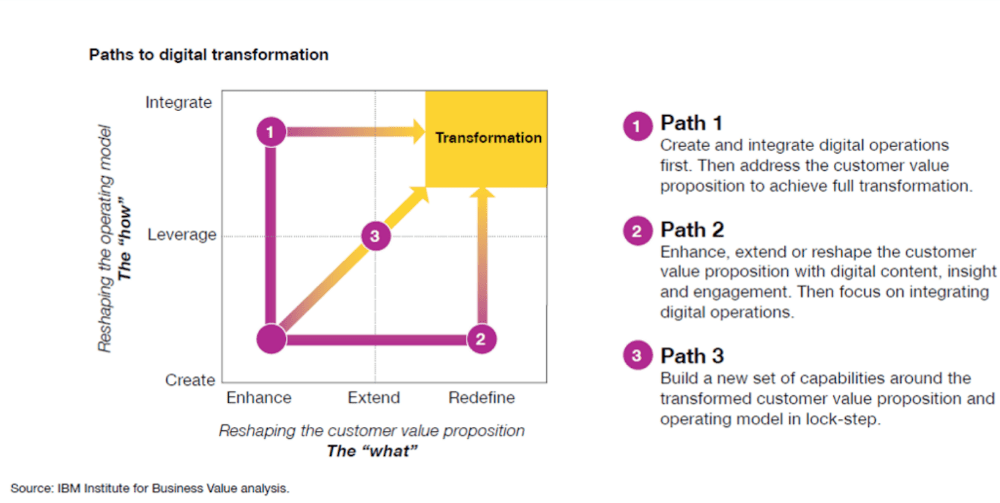
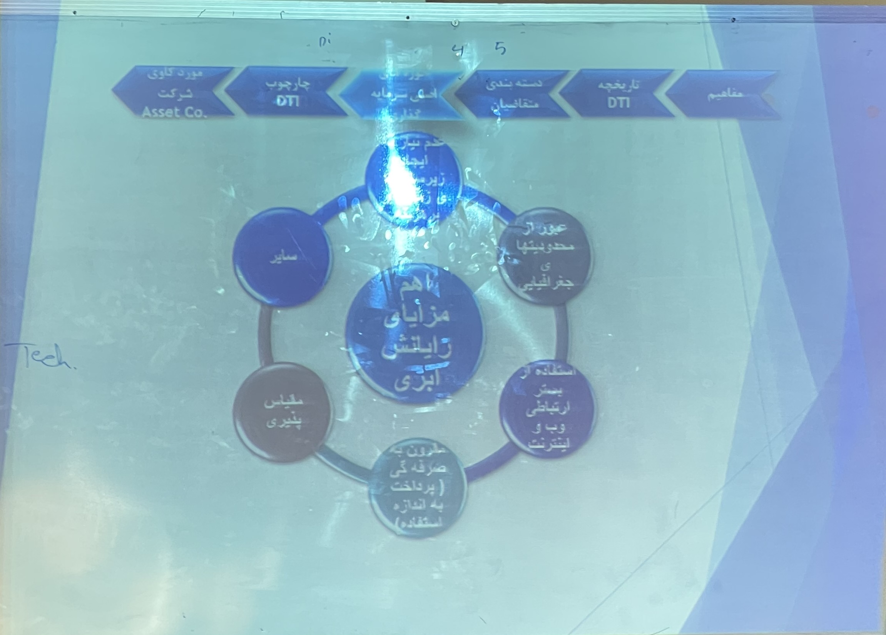

# Digital Transformation
- Lower operation cost & higher quality output.
- Fundamental changes. Disruptive (destruction for building better).
- High risk but has great outcomes on success.
- It's the future. not transforming will result in dieing of bussiness.
- It will create new horizons for the bussiness.
- It's not an improvement but a revolution.
- WEF: World Economy Forum
- Needs:
	- Free access to information
	- Reliebility
	- Cybersecurity
- Crowdsource/Crowdfunding

## Iran's DT Framework

## Capgemni

## Delloitte

## Cognizant

## Gartner

## McKinsey

## IBM

## Cloud

## Last session
- **Digitization:** Transforming analog **data** to digital. (e.g. Paper to excel sheet, printed photo -> jpeg file)

- **Digitalization:** Using digital tools(application)- digitalization of **processes**.

- **Digital Transformation:** Digitize the way we make money (**business model**).