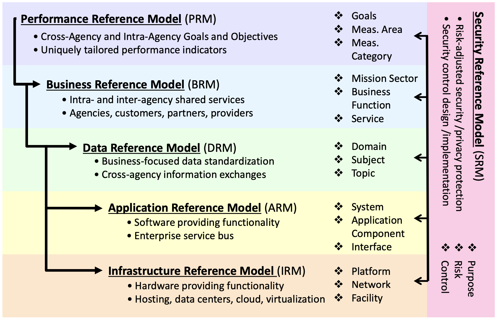

# FEAF v2 (Federal Enterprise Architecture Framework)

- The real value is to facilitate planning for the future in a way that transforms the government more efficiently.
- Scope levels of the Federal Architecture (INFSASSA)
	1. International
	2. National
	3. Federal
	4. Sector
	5. Agency
	6. Segment
	7. System
	8. Application

## CPM (Collaborative Planning Methodology)

- 2 phases, 5 steps, 18 activities
- A simple & repeatable process
- Consists of integrated, multi-disciplinary analysis
- Creates awareness, visibility and transparency
- Reusing rather than inventing from scratch
- Replacement for the FSAM (Federal Segment Architecture Methodology)

## CRM (Consolidated Reference Model)

- Consists of a set of interrelated “reference models” in 6 sub-architecture domains:
	- Strategy (Performance)
	- Business
	- Data
	- Applications
	- Infrastructure
	- Security
- Designed to identify:
	- duplicative investments
	- gaps
	- opportunities for collaboration
- A line of sight from the strategic goals at the highest organizational level
to the software and hardware infrastructure that enable achievement of those goals.

### PRM (Performace Reference Model)

- Goal
	- grouping of investments and activities
	- Compliance with OMB and GPRA Modernization Act
	- enable cross-platform information linkages (performance.gov)
	- *identify the strategic element supported by the
activity or investment*
- Measurement Area
	- performance indicators associated with the investment of activity
supports that goal
- Measurement Category, refines Measurement Area
	- *how the activity or investment*

- Line of sight: forms a value chain for tracing lower level investments and activities to higher level outcomes.

### BRM (Bussiness Reference Model)

- Identifying opportunities to share services government-wide
- Reducing costs by eliminating duplication within the enterprise
- BIAN
	- it's service categorization is suitable.
	- is used by Bank Melli of Iran.

- Business Architecture for Decision Support
	- Line of sight: input > output > outcome
- Business Process Modeling
	- use of BPMN/BPEL and UML as "open" industry standards.

### DRM (Data Reference Model)

- common identification, use, and appropriate sharing of data/information.
- Using the DRM to Compare Data Sources across Federal Agencies
- Using the DRM to Create a Standardized Information Exchange
- *increases the Federal government’s agility in drawing out the value of information as a strategic asset.*
- We have a Master Data problem in Iran (where is the reference data and who owns them?)
- Data Governence
	- Data stewardship
	- Data protection

- Data Description
- Data Context
- Data Sharing

### ARM (Application Reference Model)

- gaps and redundancies will become evident
- opportunities for sharing, reuse, and consolidation or renegotiation of licenses.
- **Systems:** are discrete sets of information technology, data, and related resources, organized for the collection, processing, maintenance, use, sharing, dissemination or disposition of information in support of a specific business process. The ARM Systems category does not include mission-specific systems.
- **Application Components:** each part of system that can work independently. eg. workflow management, document management, records management, etc.
- **Interfaces:** are protocols

### IRM (Infrastructure Reference Model)

- IT infrastructure & Network that host them
- The generic (underlying) platform consisting of hardware, software and delivery platform upon which specific/customized capabilities (solutions, applications) may be deployed.
- sharing and reuse of infrastructure to reduce costs, increase interoperability

- Using the IRM to Create an IT Asset Management (ITAM)
- Using the IRM to Identify Opportunities for Shared Services
- 

### SRM (Security Reference Model)

- Risk:
	1. impacts of occurs
	2. likelihood of occurrence
- Primary ways to deal with risk:
	- Mitigate Risk
	- Avoid Risk
	- Transfer Risk
	- Accept Risk
	- Standards: ISO 27000/ISO 2714
