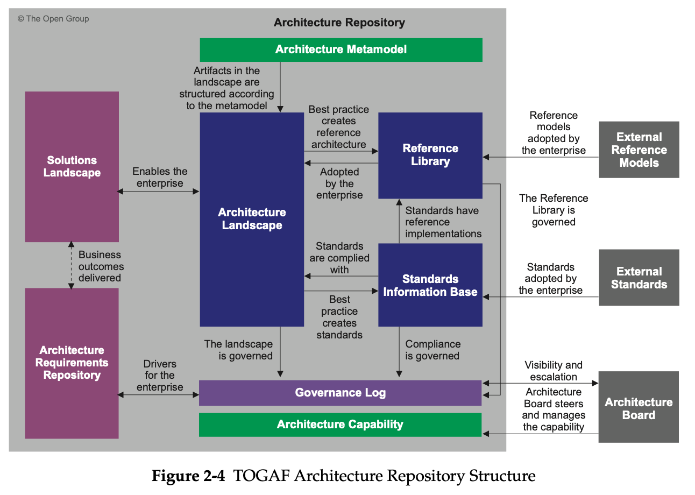

# ToGAF (The Open Group Architecture Framework)

- **It has 6 parts**
	1. ADM
	2. ADM Guide and Techniques
	3. Architecture Content Framework
	4. Architecture Capability Framework
	5. Reference Models
	6. Enterprise Continuum

## ADM (Architecture Development Methodology)

### ADM Hierarchy

### ADM Versioning

## Content Metamodel

## Artifacts & Buildling Blocks

- Each Building block has 3 kind of artifacts:
	- Catalogs
	- Matrices
	- Diagrams

## Enterprise Continuum

## Architecture Repository

## Artifacts assosiation with metamodel

## Architecture Continuum

## Architecure Definition

